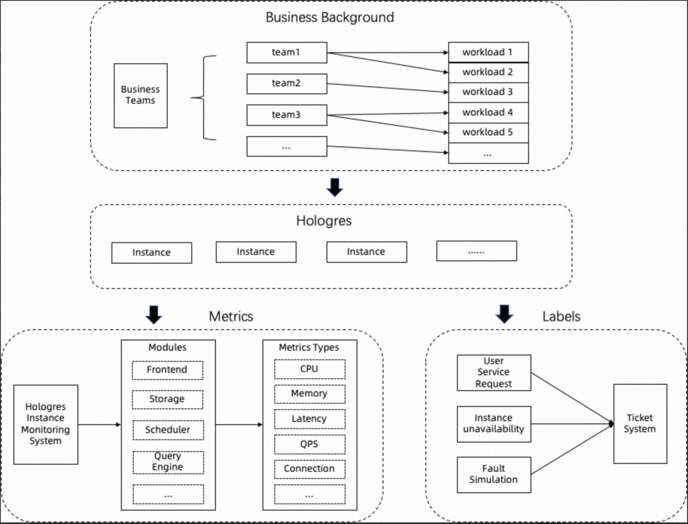
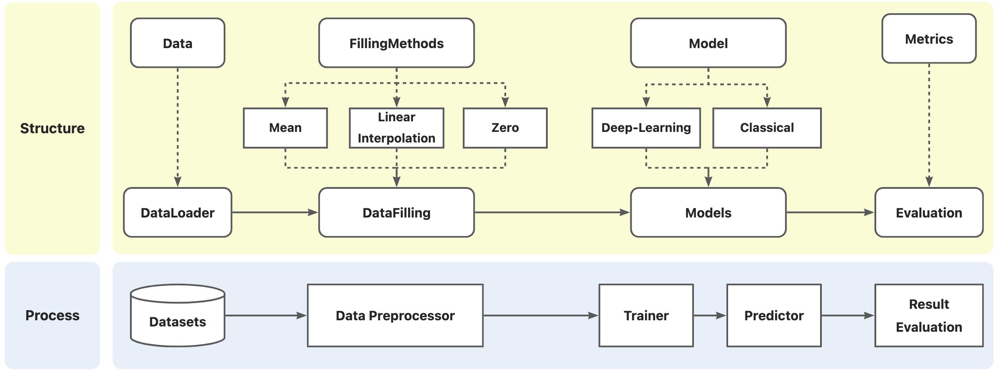

<a name="t3FFN"></a>
## Benchmarking Multivariate Time Series Anomaly Detection with Large-Scale Real-World Datasets
In this paper, we advance the benchmarking of time series anomaly detection from datasets, evaluation metrics, and algorithm comparison. <br />To the best of our knowledge, we have generated the largest real-world dataset for multivariate time series anomaly detection (MTSAD) from the Hologres AIOps system in the Alibaba Cloud platform. <br />We review and compare popular evaluation metrics including recently proposed.<br />To evaluate classic machine learning and recent deep learning methods fairly, we have performed extensive comparisons of these methods on various datasets. <br />We believe our benchmarking and datasets can promote reproducible results and accelerate the progress of MTSAD research.

<a name="JwX86"></a>
## 1、Datasets
<a name="T1rHA"></a>
### 1.1 Real-world Hologres AIOps Dataset
The Hologres Datasets are on [https://sreworks.oss-cn-beijing.aliyuncs.com/aiops/BenchmarkDataFinal.zip](https://sreworks.oss-cn-beijing.aliyuncs.com/aiops/BenchmarkDataFinal.zip) <br />For each instance, a csv file is given. The train dataset and test dataset in each instance should be split evenly through all the timestamps.

- Illustration of the collection of Hologres AIOps dataset


All the metrics and labels in our dataset are derived from real-world scenarios. All metrics were obtained from the Hologres instance monitoring system and cover a rich variety of metric types, including **CPU usage, queries per second (QPS) and latency**, which are related to many important modules within Hologres. We obtain labels from the ticket system, which integrates three main sources of instance anomalies: user service requests, instance unavailability and fault simulations . User service requests refer to tickets that are submitted directly by users, whereas instance unavailability is typically detected through existing monitoring tools or discovered by Site Reliability Engineers (SREs). Since the system is usually very stable, we augment the anomaly samples by conducting fault simulations. Fault simulation refers to a special type of anomaly, planned beforehand, which is introduced to the system to test its performance under extreme conditions. All records in the ticket system are subject to follow-up processing by engineers, who meticulously mark the start and end times of each ticket. This rigorous approach ensures the accuracy of the labels in our dataset. 

- Statistic Characteristic of Hologres AIOps Datasets

| Instance | Samples | Dims | Anomaly | Anomaly Rate |
| --- | --- | --- | --- | --- |
| instance0 | 167950 | 21 | 2117 | 1.260% |
| instance1 | 167960 | 209 | 66 | 0.039% |
| instance2 | 167950 | 29 | 646 | 0.385% |
| instance3 | 167930 | 40 | 71 | 0.042% |
| instance4 | 167962 | 199 | 238 | 0.142% |
| instance5 | 167950 | 19 | 3 | 0.002% |
| instance6 | 167960 | 77 | 711 | 0.423% |
| instance7 | 167964 | 9 | 24 | 0.014% |
| instance8 | 167946 | 53 | 67 | 0.040% |
| instance9 | 167962 | 19 | 59 | 0.035% |
| instance10 | 167962 | 22 | 17 | 0.010% |
| instance11 | 167964 | 35 | 146 | 0.087% |
| instance12 | 167954 | 299 | 319 | 0.190% |
| instance13 | 167952 | 51 | 1783 | 1.062% |
| instance14 | 167958 | 44 | 1493 | 0.889% |
| instance15 | 167954 | 16 | 314 | 0.187% |
| instance16 | 167952 | 50 | 667 | 0.397% |
| instance17 | 167962 | 102 | 73 | 0.043% |
| instance18 | 167952 | 26 | 9613 | 5.724% |
| instance19 | 167956 | 27 | 27 | 0.016% |
| instance20 | 167948 | 98 | 94 | 0.056% |
| instance21 | 167946 | 51 | 2711 | 1.614% |
| instance22 | 167966 | 19 | 7 | 0.004% |
| instance23 | 167958 | 56 | 32 | 0.019% |
| instance24 | 167954 | 65 | 3452 | 2.055% |
| instance25 | 167952 | 27 | 3 | 0.002% |
| instance26 | 167946 | 332 | 7 | 0.004% |
| instance27 | 167948 | 38 | 125 | 0.074% |
| instance28 | 167958 | 68 | 570 | 0.339% |
| instance29 | 46194 | 45 | 99 | 0.214% |
| instance30 | 167942 | 35 | 1271 | 0.757% |
| instance31 | 167944 | 74 | 161 | 0.096% |
| instance32 | 167932 | 130 | 374 | 0.223% |
| instance33 | 167958 | 45 | 5 | 0.003% |
| instance34 | 167939 | 87 | 150 | 0.089% |
| instance35 | 167948 | 37 | 91 | 0.054% |
| instance36 | 167950 | 200 | 66 | 0.039% |
| instance37 | 167956 | 185 | 9 | 0.005% |
| instance38 | 167962 | 27 | 91 | 0.054% |
| instance39 | 167950 | 121 | 208 | 0.124% |
| instance40 | 167956 | 27 | 259 | 0.154% |
| instance41 | 167948 | 47 | 158 | 0.094% |
| instance42 | 167934 | 92 | 351 | 0.209% |
| instance43 | 167948 | 43 | 554 | 0.330% |
| instance44 | 167934 | 92 | 351 | 0.209% |
| instance45 | 167964 | 134 | 811 | 0.483% |
| instance46 | 167952 | 25 | 2 | 0.001% |
| instance47 | 167958 | 30 | 26 | 0.015% |

Due to Alibaba Internal Data Exposure Policy, we delete all data's timestamp and column name.<br />The last column of every instance file is anomaly label, other columns are different system metrics.
<a name="aCTNS"></a>
### 1.2 Public Datasets
You can download the Public Datasets through the following url: [https://drive.google.com/drive/folders/1RaIJQ8esoWuhyphhmMaH-VCDh-WIluRR?usp=sharing](https://drive.google.com/drive/folders/1RaIJQ8esoWuhyphhmMaH-VCDh-WIluRR?usp=sharing)
<a name="xA92t"></a>
## 2、Evaluation Metrics
The Evaluation Metrics we considered are:

- Accuracy
- Precision
- Recall
- F1-Score with Point Adjustment
- Composite F1-score
- Affiliation Score
- Volume Under the Surface (VUS) Metric

For more details, see metrics files in：
```dockerfile
sreworks-ext/aiops/AnomalyDetectionBenchmark/main/evaluation
```

<a name="Om1HR"></a>
## 3、Models
Methods included are shown below:

- **Classics**
   - **Local Outlier Factor (LOF):** LOF measures the local deviation of the density of a given sample with respect to its neighbors.
   - **K-Nearest Neighbors (KNN):** KNN views the anomaly score of the input instance as the distance to its $k$-th nearest neighbor.
   - **Isolation Forest (IForest):** IForest isolates observations by randomly selecting a feature and then randomly selecting a split value between the maximum and minimum values of the selected feature.
   - **Long short-term memory (LSTM): **LSTM is among the family of RNNs and LSTM \citet{hochreiter1997long} and can be effectively deployed in the TSAD problem, where the anomalies are detected by the deviation between the predicted and actual ones.
   - **LSTM based autoencoder (LSTM-AE):** reconstructs input sequence and regards samples with high reconstruction errors as anomalies. 
   - **LSTM based variational autoencoder(LSTM-VAE):** combines the power of both the LSTM-based model and VAE-based model, which learns to encode the input sequence into a lower-dimensional latent space representation and then decodes it back to reconstruct the original sequence. Similar to LSTM-AE, the reconstruction errors between the input sequence and the reconstructed ones are defined as anomaly scores.
   - **Deep Support Vector Data Description (DeepSVDD):** DeepSVDD trains a neural network while minimizing the volume of a hypersphere that encloses the network representations of the data, forcing the network to extract the common factors of variation.
   - **Copula Based Outlier Detector (COPOD):** COPOD is a hyperparameter-free, highly interpretable anomaly detection algorithm based on empirical copula models.
   - **Empirical-Cumulative-distribution-based Outlier Detection (ECOD):** ECOD is a hyperparameter-free, highly interpretable anomaly detection algorithm based on empirical CDF functions. Basically, it uses ECDF to estimate the density of each feature independently, and assumes that the anomaly locates the tails of the distribution.
- **AnomalyTransformer**
   - **Anomaly Transformer** is a representation of a series of explicit association modelling work which detects anomalies by association discrepancy between a learned Gaussian kernel and attention weight distribution. 
- **BeatGAN**
   - **Adversarially Generated Model (BeatGAN): **BeatGAN outputs explainable results to pinpoint the anomalous time ticks of an input beat, by comparing them to adversarially generated beats. 
- **DAGMM**
   - **Deep Autoencoding Gaussian Mixture Model (DAGMM):** DAGMM utilizes a deep autoencoder to generate a low-dimensional representation and reconstruction error for each input data point, which is further fed into a Gaussian Mixture Model (GMM).
- **DCdetector**
   - **DCdetector** is a dual attention contrastive representation learning framework whose motivation is similar to anomaly transformer but is concise as it does not contain a specially designed Gaussian Kernel or a MinMax learning strategy, nor a reconstruction loss. Contrastive representation learning help to distinguish anomalies from normal points. 
- **USAD**
   - **UnSupervised Anomaly Detection (USAD): **USAD is based on adversely trained autoencoders to isolate anomalies while providing fast training.

<a name="tVl84"></a>
## 4、Experiments Running（如何通过代码和数据复现结果）

- Download datasets
   - Download our datasets from  [https://sreworks.oss-cn-beijing.aliyuncs.com/aiops/BenchmarkDataFinal.zip](https://sreworks.oss-cn-beijing.aliyuncs.com/aiops/BenchmarkDataFinal.zip) , unzip the file and put it in:
```dockerfile
sreworks-ext/aiops/AnomalyDetectionBenchmark/datasets/holo
```

   - Download public datasets and put them in:
```dockerfile
sreworks-ext/aiops/AnomalyDetectionBenchmark/datasets/public
```

- Data Preprocess

We prepare three filling methods for data preprocessing: Mean, Linear Interpolation and Zero.<br />The data preprocessor file is in:
```dockerfile
sreworks-ext/aiops/AnomalyDetectionBenchmark/datasets/holo/datafill_methods.ipynb
```
You can also use your own filling method to process data.

- Train and Predict

All details for models we listed above are in:
```dockerfile
sreworks-ext/aiops/AnomalyDetectionBenchmark/models
```
To use those models to train and predict:

- Result Evaluation


*For results details, see our paper "Benchmarking Multivariate Time Series Anomaly Detection with Large-Scale Real-World Datasets".

