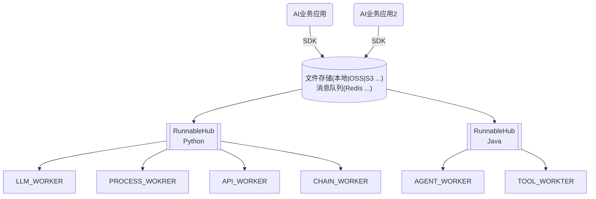

# Runnable Hub

Runnable Hub 是大模型中间件，可以用于管理和执行大模型相关的任务。它提供了一个灵活的架构，允许用户定义和执行复杂的大模型推理任务，并支持多种任务类型的扩展。

```mermaid
flowchart TD
    bizApp1(AI业务应用) -->|SDK| sub
    bizApp2(AI业务应用2) -->|SDK| sub
    sub[("`
    文件存储(本地|OSS|S3 ...)
    消息队列(Redis ...)
    `")] --> hub1[["`
    RunnableHub
    Python`"]]
    sub --> hub2[["`
    RunnableHub
    Java`"]]

    hub1 --> LLM_WORKER & PROCESS_WOKRER & API_WORKER & CHAIN_WORKER
    hub2 --> AGENT_WORKER & TOOL_WORKTER

```
